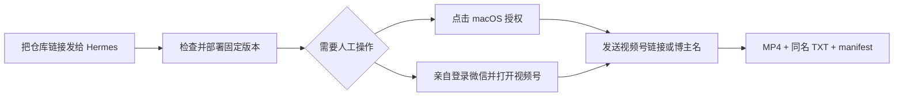

<div align="center">

# 微信视频号本地归档与自动转写 · Hermes Skill

**微信视频号下载 · 博主历史批量归档 · MP4 自动生成原始 TXT · Hermes 一键部署**

把分享链接或博主名称发给 Hermes，让视频、逐字稿和归档清单都留在自己的 Mac。

**简体中文** · [English](./README_EN.md)


[](#运行环境)
[](./SKILL.md)
[](#文件最后在哪里)
[](https://github.com/Zhenxiangai/wechat-archive/releases/tag/v0.6.0)
[](./LICENSE)
[](https://github.com/Zhenxiangai/wechat-archive/stargazers)

如果它刚好解决了你的内容归档问题，欢迎点一个 **Star**，让更多需要本地保存微信内容的人看到它。

</div>

## 30 秒开始

把下面这句话直接发给 Hermes：

```text
请部署这个开源项目：https://github.com/Zhenxiangai/wechat-archive
```

Hermes 会先检查固定版本的 Skill，解释安全扫描为什么会显示 `caution`，再逐步请求安装授权：

```text
https://raw.githubusercontent.com/Zhenxiangai/wechat-archive/v0.6.0/SKILL.md
```

电脑主人不需要使用终端、开发工具或复制 Cookie。需要人工完成的只有：确认 Hermes 解释过的操作、点击 macOS 授权弹窗、亲自登录微信并打开视频号。

> [!IMPORTANT]
> 目前面向 Apple Silicon Mac。证书、系统代理和微信登录不会被静默处理；Hermes 必须先解释，再等用户授权或点击。

安装完成后，可以直接对 Hermes 说：

```text
下载这个视频号链接：https://weixin.qq.com/sph/...
搜索视频号博主「博主名称」，把同名候选列给我
把这个博主当前可见的作品全部归档
查看 job_id 为 channel-... 的下载和转写进度
```

## 它解决什么问题

| 视频号归档 | 原始逐字稿 | 全程可追踪 |
|---|---|---|
| 下载单条分享链接，搜索博主并返回同名候选，完整分页读取当前可见作品并批量建任务 | MP4 下载完成后自动生成同目录、同文件名的 TXT；保留原语言，不润色、不总结、不翻译 | 每次任务都有 `job_id`、进度与 `manifest.json`，能看见完成、等待和失败状态 |

同时支持公开微信公众号文章归档，以及通过 Hermes 自然语言调用常用动作。

## 谁会用得上

- **内容创作者与运营**：长期保存自己或公开账号的视频素材，并快速取得原始口播稿；
- **研究者与知识库用户**：把分散在视频号里的内容整理为本地可搜索的 MP4、TXT 和 manifest；
- **团队资料管理员**：批量归档博主当前可见作品，并用 `job_id` 跟踪进度；
- **AI Agent 用户**：让 Hermes 负责部署、调用和状态查询，自己只处理必要的点击与登录。

## 它不只是一个下载脚本

| 常见需求 | 本项目的处理方式 |
|---|---|
| 手里只有一条分享链接 | 解析并创建下载任务，返回可追踪的 `job_id` |
| 只记得博主名称 | 返回同名候选，选定后完整分页读取当前可见作品 |
| 想保存整个博主历史 | 批量建任务，并持续汇总完成、暂停与失败状态 |
| 下载后还要听写 | MP4 完成后无人值守生成同目录、同名原始 TXT |
| 文件越来越多 | 每个任务保留 `manifest.json`，记录来源、产物和进度 |
| 新电脑不会部署 | 把仓库链接发给 Hermes，由它解释并分阶段完成安装 |

## 小白用户会经历什么



初次安装和实际采集分成两个阶段：

1. Hermes 安装命令行依赖、Whisper 模型、本地转写 worker 和采集后端的 API 模式；这一阶段不会安装 CA、修改系统代理或登录微信。
2. 用户第一次需要采集视频号时，Hermes 单独解释本机 CA 与代理变化并请求授权，然后协助打开微信；登录和系统弹窗由用户本人完成。

默认单链接流程通过已登录的微信客户端工作，不读取浏览器 Cookie。

## 已用真实流程验收

| 验收项 | 结果 |
|---|---:|
| 博主历史完整分页 | 14 页，发现并创建 203 条任务 |
| 跑通并保留的真实视频 | 22 个 MP4 |
| 无人值守同目录逐字稿 | 22 个 TXT |
| 转写最终状态 | `pending=0`、`failed=0` |

这些数字来自一次真实验收，用来证明链路已经跑通，不代表每个账号都一定有相同作品数或下载结果。

## 现在可以做什么

- 单条视频号分享链接下载；
- 按名称搜索博主，并返回同名候选；
- 完整分页读取博主当前可见作品；
- 批量创建下载任务；
- 用 `job_id` 查询进度和最终文件；
- 用 `manifest.json` 记录归档与转写结果；
- MP4 完成后无人值守生成同名原始 TXT；
- 归档公开微信公众号文章；
- 让 Hermes 用自然语言完成以上操作。

这里刻意不包含自动润色、总结或翻译：原始逐字稿是稳定底稿，任何二次加工都应另存为派生文件。

## 文件最后在哪里

默认所有真实数据只保存在本机：

```text
~/Documents/WeChatArchive/
├── jobs/
│   ├── <job_id>/manifest.json
│   └── channel-transcriber/manifest.json
├── models/ggml-small.bin
└── video_channels/<博主>/
    ├── <视频标题>.mp4
    └── <视频标题>.txt
```

`.part` 是尚未下载完成的分片，不会被转写。TXT 是原始语音识别结果，可能包含同音误识，但不会被自动改写成“更好看”的文案。

## 手动安装与状态检查

如果由熟悉终端的人操作，可在仓库目录执行：

```bash
sh ./scripts/bootstrap.sh doctor
sh ./scripts/bootstrap.sh install
sh ./scripts/bootstrap.sh status
```

真正开启视频号采集是单独动作：

```bash
sh ./scripts/bootstrap.sh enable-capture
```

停止采集并恢复安装前保存的 HTTP/HTTPS 代理：

```bash
sh ./scripts/bootstrap.sh disable-capture
```

完整命令、Hermes 自然语言意图和新电脑 onboarding 流程见 [SKILL.md](./SKILL.md)。

## 为什么安全扫描会提示 `caution`

这个 Skill 的职责本身包含网络访问、调用本机子进程、安装用户级 LaunchAgent，以及在用户单独授权后管理本机 CA 和系统代理。Hermes 因而会给出 `caution`，这是应当展示并解释的能力提示，不应被隐藏或绕过。

安装包本身不包含下载器二进制、FFmpeg、Whisper、模型权重、登录态、证书或 Cookie；bootstrap 会下载固定并校验过的依赖。真实 MP4、TXT、manifest、浏览器配置和账号数据都不应提交到公开仓库。

## 运行环境

- Apple Silicon Mac；
- Hermes；
- Python 3.11 或更新版本；
- 初次安装时可访问互联网；
- 实际采集视频号时，由用户本人登录微信客户端。

## 已知边界

- 当前自动部署只验收了 Apple Silicon Mac；
- 视频号采集依赖已登录的微信客户端和用户单独批准的本机采集阶段；
- 微信页面或接口变化可能影响抓取，需要通过 Issue 跟进适配；
- Whisper 原始逐字稿可能出现同音误识，因此始终保留 MP4 和任务清单作为原始依据。

## 欢迎参与

欢迎在 [Issues](https://github.com/Zhenxiangai/wechat-archive/issues) 提交真实使用反馈、失效样本、文档改进或平台适配建议。请勿上传 Cookie、证书、账号信息、真实 MP4/TXT 或包含个人路径的 manifest。

如果你暂时不写代码，也可以：

- 用一个公开分享链接跑通流程并反馈结果；
- 改进中文或英文说明；
- 把项目分享给需要视频号归档、内容研究或本地知识库的朋友；
- 直接复用[中英文推广发布素材](./docs/LAUNCH_KIT.md)；
- 点一个 [Star](https://github.com/Zhenxiangai/wechat-archive) 关注后续版本。

## 许可证与第三方组件

本仓库原创文件使用 [MIT License](./LICENSE)。下载或调用的第三方组件继续遵循各自许可证，详见 [THIRD_PARTY_NOTICES.md](./THIRD_PARTY_NOTICES.md)。

本项目不是微信或 Hermes 的官方项目，也不包含它们的商标、客户端或账号数据。

---

<div align="center">

一个链接完成分享、安装和后续更新：

<https://github.com/Zhenxiangai/wechat-archive>

</div>
