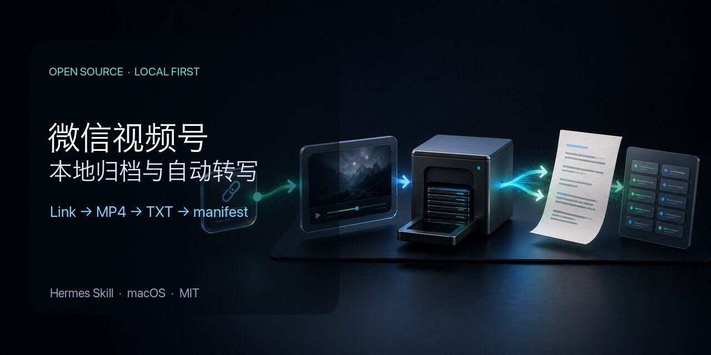

<div align="center">

# Link Video Downloader by ZhenxiangAI

**一站式多平台链接视频下载、图文归档与逐字稿生成**

**视频号 · B站 · 小红书 · 抖音**

发一个链接，在自己的 Mac 上得到视频、图文、带时间线的原始逐字稿和可追踪清单。

**简体中文** · [English](./README_EN.md)



[](#运行边界)
[](https://github.com/Zhenxiangai/link-video-downloader-zhenxiangai/releases/latest)
[](#内容包)
[](./LICENSE)

</div>

> [!IMPORTANT]
> 项目已更名为 **Link Video Downloader by ZhenxiangAI**。`v1.0.2` 保留内部 Hermes Skill ID `wechat-archive` 和原有本地目录，已有用户可原位升级。

## 平台能力

| 平台 | 单链接 | 历史批量 | 正式内容包 |
|---|---|---|---|
| 微信视频号 | 视频 | 先盘点总数，再按用户数量下载 | `video.mp4` + 三种原始逐字稿 |
| B站 | 视频 | 先盘点总数，再按用户数量下载 | `video.mp4` + 三种原始逐字稿 |
| 小红书 | 图文或视频 | 后续版本 | `正文.md` + `配图/`，或视频与逐字稿 |
| 抖音 | 视频 | 先盘点总数，再按用户数量下载 | `video.mp4` + 三种原始逐字稿 |

视频正式目录只保留一个 `video.mp4`。`原始逐字稿.txt` 从 JSON 分段机械生成，按时间由上到下排列；SRT 和 JSON 同时保留。项目不自动润色、纠错、总结或翻译原始逐字稿。

B站默认使用仓库固定的透明派生核心；核心提取失败时才切换运行时 API/CDN 备选。两条路线均已真实验证，任务只保留最终成功路线的一个视频。

微信公众号单篇与历史批量代码、已有任务和归档仍被保留，但采集阶段当前暂停，不属于当前视频版发布基线；后续继续迭代。

## 统一命令

```bash
export WECHAT_ARCHIVE_ENABLED=1
SCRIPT="$PWD/scripts/wechat_archive.py"
PYTHON="${HERMES_HOME:-$HOME/.hermes}/hermes-agent/venv/bin/python"
[ -x "$PYTHON" ] || PYTHON="$(command -v python3)"

"$PYTHON" "$SCRIPT" extract --url '<支持的单个链接>'
"$PYTHON" "$SCRIPT" status --job-id 'content-YYYYMMDDTHHMMSSZ-1234abcd'
```

`extract` 立即返回一个 `content-*` 和相对 manifest 路径，下载、归档和转写由 content worker 顺序完成。视频号在用户完成一次无人值守授权后，每次任务自动临时启用兼容路由并恢复原代理。

单个视频号链接由 `download-channel-url` 自动打开微信并提交。视频号、B站和抖音的作者批量统一为两步：先盘点总数并冻结作品清单，向用户询问下载数量，收到回复后才使用同一父 Job 提交子任务。详细路由见 [SKILL.md](./SKILL.md)。

## 内容包

```text
~/Documents/WeChatArchive/
├── content/
│   ├── 视频号/<标题>--<作品标识>/
│   ├── B站/<标题>--<作品标识>/
│   ├── 小红书/<标题>--<作品标识>/
│   └── 抖音/<标题>--<作品标识>/
├── jobs/
│   ├── content-.../manifest.json
│   ├── content-worker/manifest.json
│   └── channel-transcriber/manifest.json
├── models/ggml-small.bin
└── video_channels/       # 保留的旧视频号批量目录
```

manifest 记录状态、标题、内容类型、规范链接、实际路线、相对产物路径、字节数和 SHA-256。

## 安装与原位升级

仓库目录中可执行：

```bash
sh ./scripts/bootstrap.sh doctor
sh ./scripts/bootstrap.sh install
sh ./scripts/bootstrap.sh status
```

`install` 复用 Hermes 自带 Python，并安装/复用固定透明派生核心、FFmpeg、whisper.cpp、固定模型和视频号后端；无需另装全局 Python。它管理视频号后端、旧转写 worker、新 content worker 三个用户级 LaunchAgent。透明核心从不可变提交下载并进行完整源码树校验。安装本身不导入 Cookie、不安装 CA、不修改系统代理、不代替用户登录。

新机或旧版本用户按以下方式安装/原位覆盖 Skill，然后重跑上述三条命令：

```bash
hermes skills install 'https://raw.githubusercontent.com/Zhenxiangai/link-video-downloader-zhenxiangai/v1.1.0/SKILL.md' --category social-media --name wechat-archive --force --yes
```

旧 `article-*`、`batch-*`、`channel-*`、`media-*`、`video_channels/` 和 manifest 原地保留；项目不增加迁移器、自动更新器或回滚管理器。

## 登录态与授权

- B站、小红书、抖音可在用户明确授权后，从已登录 Safari 或 Chrome 按平台导入持久 Cookie jar；新机无需为此额外安装 Chrome。普通任务只读持久 jar，不逐任务读取浏览器。
- 用户发送视频号链接即授权仅为该任务临时启用本机 CA 与采集代理。若没有现有系统代理，任务结束后会恢复原网络设置并删除该任务 CA；若已有 Clash Verge Rev（Mihomo）系统代理，Skill 会自动加载仅存在于当前任务的内存路由，系统代理端口和用户持久配置始终不变，任务结束后恢复原运行配置。其他无可控接口的系统代理会保持不变并明确停止。只有微信登录、macOS 权限弹窗、不受支持的现有代理或无法自动打开视频时才需要用户介入。
- 任务在首次授权或登录态失效时保持原 `job_id`，进入 `waiting_for_authorization` 或 `waiting_for_reauthentication`。
- Cookie、账号凭证、浏览器 Profile、CA 私钥和代理快照不进入 Git、内容包、manifest 或 Hermes 回执。

## 当前验收状态

新统一链路已真实完成：B站 1080P 视频、小红书图文与视频、抖音视频、视频号 1080P 视频。四个视频任务都只有一个正式视频和三种中文名逐字稿；小红书图文保留 `正文.md` 与 4 张有效配图。所有正式产物的字节数和 SHA-256 均与 manifest 一致。

`v1.0.1` 已补齐 Hermes 直链首次安装闭环。`v1.0.2` 只迁移公开品牌和仓库地址，并让固定核心解压不依赖仓库目录名；内部 Skill ID、本地数据和四平台功能边界保持不变。

`v1.0.3` 改进视频号授权恢复，并支持 Clash Verge Rev/Mihomo 已启用时的任务级内存路由：不关闭、不替换系统代理，不写入用户持久配置，任务结束后恢复原运行态。

`v1.1.0` 新增视频号、B站和抖音作者历史批量：先盘点当前可见总数且不下载，再按用户确认数量从最新开始抓取、转写。真实小批量验收覆盖视频号 280 个可选、B站 913 个可选及抖音作者列表，三个平台各完成 2 条视频与三种逐字稿，24 个正式产物均与 manifest 的字节数和 SHA-256 一致。

后续版本计划增加小红书作者批量和公众号文章抓取；当前版本不承诺这两项历史批量能力。

## 运行边界

- 第一版只承诺 Apple Silicon Mac；Windows、Linux、Intel Mac、GUI 和 Web 管理台不在范围内。
- 平台页面、内部接口和反爬规则可能变化；固定源码保证独立存活，不保证未来无需适配。
- “完整历史”只指平台当前可见、当前账号有权访问的内容，不包括已删除、私密、付费无权或风控阻断内容。
- 软件许可证不授予平台内容抓取、转载、传播或商业使用权。用户必须对账号、平台条款和内容权利自行负责。

## 许可证与分发

根 [MIT License](./LICENSE) 只覆盖 ZhenxiangAI 原创文件及明确采用 MIT 的文件。仓库内的 ZhenxiangAI 透明派生核心保留 `yt-dlp 2026.07.04` 的 Unlicense、真实来源和完整第三方许可文本。

Release 只包含可审计源码与 notices，不包含 FFmpeg、whisper.cpp、模型、视频号后端二进制、Cookie、CA、登录态或真实归档。详见 [THIRD_PARTY_NOTICES.md](./THIRD_PARTY_NOTICES.md)。

## 参与

欢迎提交真实失效样例、文档改进或平台适配 Issue。请勿上传 Cookie、证书、账号信息、真实媒体、逐字稿或包含个人路径的 manifest。
