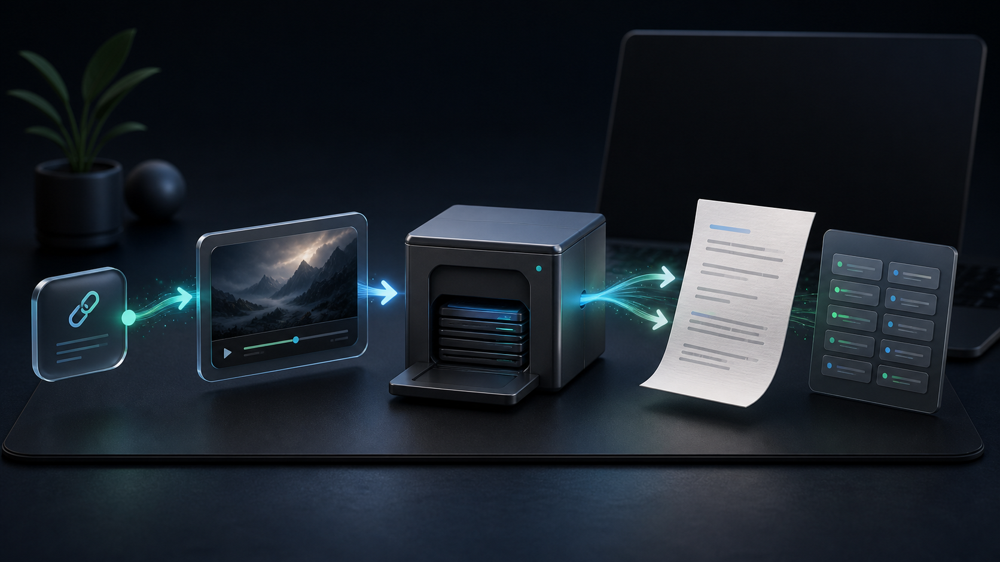

<div align="center">

[简体中文](./README.md) · **English**

# WeChat Channels Archiver & Auto Transcriber

**Share-link download · Creator-history batch archive · MP4 → raw TXT · One-link Hermes deployment**

A local-first macOS CLI and Hermes Skill that turns a WeChat Channels link or creator name into an organized local archive: MP4, same-name raw transcript, and a traceable manifest.



[](#requirements)
[](./SKILL.md)
[](#data-layout)
[](https://github.com/Zhenxiangai/wechat-archive/releases/tag/v0.6.0)
[](./LICENSE)
[](https://github.com/Zhenxiangai/wechat-archive/stargazers)

If this project solves a real archiving problem for you, a **Star** helps more local-first users discover it.

</div>

## Start in 30 seconds

Send this repository URL to Hermes and say “部署这个开源项目”:

```text
https://github.com/Zhenxiangai/wechat-archive
```

Hermes will inspect the fixed Skill entry below, explain its expected security-scan warnings, and ask before installing it:

```text
https://raw.githubusercontent.com/Zhenxiangai/wechat-archive/v0.6.0/SKILL.md
```

Hermes installs the Skill, dependencies, model, user-level workers, and the verified Channels backend. The computer owner only approves clearly described changes, allows macOS dialogs, and logs in to WeChat personally. They do not use Terminal, developer tools, or copy a Cookie.

After setup, talk to Hermes naturally:

```text
Download this WeChat Channels link: https://weixin.qq.com/sph/...
Search for the creator "Creator Name" and show me same-name candidates.
Archive every currently visible post from this creator.
Show download and transcription progress for job_id channel-...
```

## Who is it for?

- **Creators and social teams** preserving public video material and extracting raw spoken copy;
- **Researchers and knowledge-base builders** turning scattered Channels content into searchable local files;
- **Archive operators** who need creator-wide pagination, batch jobs, and explicit progress;
- **AI-agent users** who want Hermes to deploy and operate the workflow while humans handle only approvals and login.

## More than a download script

| Need | What this project does |
|---|---|
| You only have a share link | Resolves it, creates a download job, and returns a traceable `job_id` |
| You only remember a creator name | Returns same-name candidates, then paginates every currently visible post |
| You want a creator-wide archive | Creates batch tasks and reports completed, paused, and failed items |
| You still need a transcript | Generates a same-directory, same-name raw TXT after each MP4 completes |
| Your archive keeps growing | Writes a `manifest.json` for source, artifacts, and progress |
| A new Mac needs setup | Hermes explains and performs deployment in separately approved stages |

Public WeChat Official Account article archiving is included as well.

## Trust and privacy boundary

This repository contains source code and documentation only. It does not publish the parent workspace, local archives, job manifests, MP4/TXT outputs, Cookies, certificates, proxy settings, browser profiles, or account configuration.

This package contains no downloader binary, FFmpeg binary, Whisper binary, model weights, login state, certificate, or Cookie. Its bootstrap downloads fixed verified artifacts and keeps certificate/proxy activation behind a separate approval step.

## Automatic setup

- Apple Silicon Mac;
- Hermes and Python 3.11 or newer;
- internet access during setup.

Hermes runs:

```bash
sh ./scripts/bootstrap.sh doctor
sh ./scripts/bootstrap.sh install
sh ./scripts/bootstrap.sh status
```

`install` obtains FFmpeg and whisper.cpp through Homebrew, downloads and verifies the fixed multilingual small model, installs Hermes Computer Use, starts the unattended transcriber, and starts `wx_channels_download` in API-only mode. It does not install a CA, change the system proxy, or log in to WeChat.

Capture is a second, clearly approved action:

```bash
sh ./scripts/bootstrap.sh enable-capture
```

Hermes first explains the local CA and system-proxy change, requests approval, helps the user click macOS permission dialogs, then opens WeChat for the user to log in and enter 视频号. The default single-link path does not use a browser Cookie. `disable-capture` stops interception and restores the saved HTTP/HTTPS proxy settings.

## Verified on a real archive run

| Check | Result |
|---|---:|
| Creator-history pagination | 14 pages, 203 items discovered and queued |
| Completed sample archive | 22 MP4 files |
| Unattended same-directory transcripts | 22 TXT files |
| Final transcription state | `pending=0`, `failed=0` |

These numbers document one real acceptance run. They prove the workflow, not a guaranteed item count for every account.

## Unattended raw transcription

Review `config.example.env`, export any non-default paths, then install the user LaunchAgent:

```bash
chmod +x scripts/manage_transcriber.sh
./scripts/manage_transcriber.sh install
```

The installer checks existing commands and the model, generates a machine-local plist under `~/Library/LaunchAgents`, then starts a `RunAtLoad + KeepAlive` worker. It does not install dependencies or download anything.

Inspect progress:

```bash
./scripts/manage_transcriber.sh status
```

Remove only the worker service and its generated plist:

```bash
./scripts/manage_transcriber.sh uninstall
```

Uninstall keeps all archive data, model files, MP4 files, TXT files, and manifests.

## CLI

Enable explicit archive writes in the current shell:

```bash
export WECHAT_ARCHIVE_ENABLED=1
SCRIPT="$PWD/scripts/wechat_archive.py"
```

Common actions:

```bash
python3 "$SCRIPT" archive-article --url 'https://mp.weixin.qq.com/s/...'
python3 "$SCRIPT" download-channel-url --url 'https://weixin.qq.com/sph/...'
python3 "$SCRIPT" search-channel-author --query '博主名称'
python3 "$SCRIPT" download-channel-author --author 'v2_xxx@finder'
python3 "$SCRIPT" status --job-id 'channel-YYYYMMDDTHHMMSSZ-1234abcd'
python3 "$SCRIPT" transcriber-status
python3 "$SCRIPT" self-check
```

The resident worker scans only `$WECHAT_ARCHIVE_ROOT/video_channels/**/*.mp4`. Download fragments such as `.part` are ignored. For every completed video it creates:

```text
video title.mp4
video title.txt
```

TXT is the raw source-language speech transcript. It is not polished, summarized, or translated.

That is intentional: the raw transcript stays as the stable source. Summaries, translations, or polished copy should be separate derived files.

## Hermes

Official repository: <https://github.com/Zhenxiangai/wechat-archive>

Hermes can install the tagged release directly:

```bash
NO_PROXY='127.0.0.1,localhost' no_proxy='127.0.0.1,localhost' hermes skills install 'https://raw.githubusercontent.com/Zhenxiangai/wechat-archive/v0.6.0/SKILL.md' --category social-media --name wechat-archive --force --yes
```

The `--force` is expected because Hermes flags this Skill's intentional network, subprocess, certificate/proxy, and LaunchAgent operations as `caution`. Hermes should show that result and obtain approval first. The command-scoped `NO_PROXY` values only work around Hermes 0.20.0's bare-IPv6 parsing issue; they do not rewrite the user's saved proxy settings.

Install this directory as a local Hermes Skill, for example:

```bash
mkdir -p "$HOME/.hermes/skills/social-media"
ln -s "$PWD" "$HOME/.hermes/skills/social-media/wechat-archive"
```

Hermes can then archive explicit URLs, search or download Channels authors, inspect jobs, and query the unattended transcriber through the actions documented in `SKILL.md`. Starting the blocking worker remains a local operator action.

## Data layout

```text
~/Documents/WeChatArchive/
├── jobs/
│   ├── <job_id>/manifest.json
│   └── channel-transcriber/manifest.json
├── models/ggml-small.bin
└── video_channels/<author>/
    ├── <title>.mp4
    └── <title>.txt
```

## Requirements

- Apple Silicon Mac;
- Hermes;
- Python 3.11 or newer;
- internet access during setup;
- the computer owner logs in to WeChat for Channels capture.

## Known limits

- Automated onboarding has currently been verified only on Apple Silicon Macs.
- Channels capture requires a logged-in WeChat client and a separately approved local capture stage.
- WeChat page or API changes may require adapter updates.
- Whisper can misrecognize words, so the MP4 and manifest remain the source of truth.

## Contributing

[Issues](https://github.com/Zhenxiangai/wechat-archive/issues) are welcome for real-world results, broken public samples, documentation improvements, and platform-adaptation ideas. Never upload Cookies, certificates, account data, real MP4/TXT archives, or manifests containing personal paths.

You can also help without writing code: verify one public link, improve a translation, reuse the [bilingual launch kit](./docs/LAUNCH_KIT.md), share the project with an archive or research community, or [Star the repository](https://github.com/Zhenxiangai/wechat-archive).

## Licensing

The original files are released under the MIT License. Read `LICENSE` and `THIRD_PARTY_NOTICES.md`; downloaded third-party components retain their own terms.

This is not an official WeChat or Hermes project and contains neither product's trademarks, client software, or account data.
